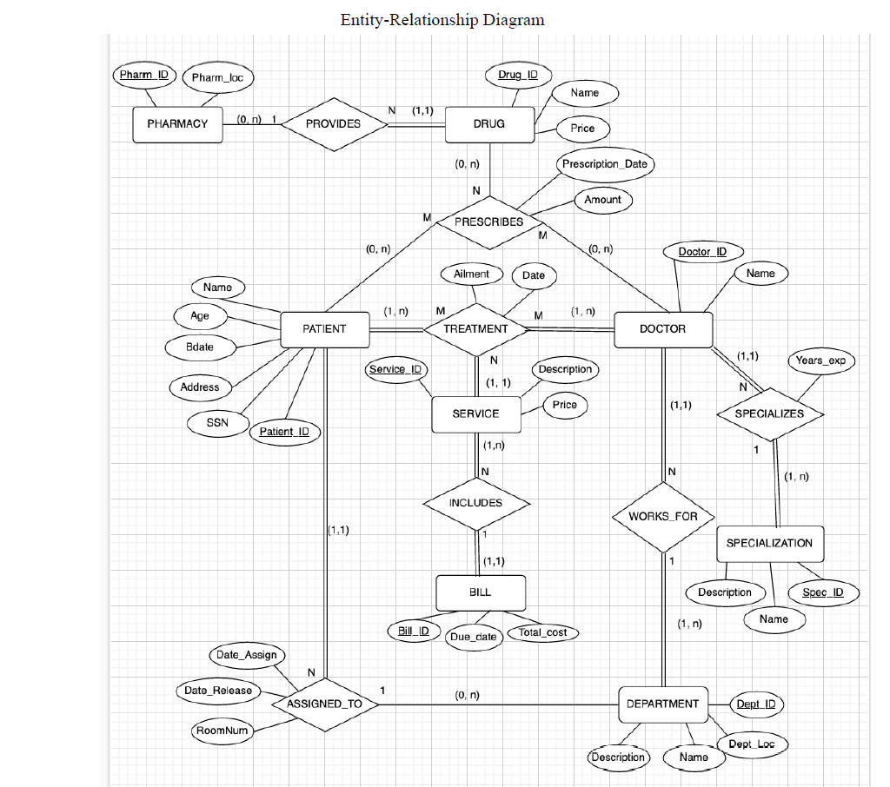
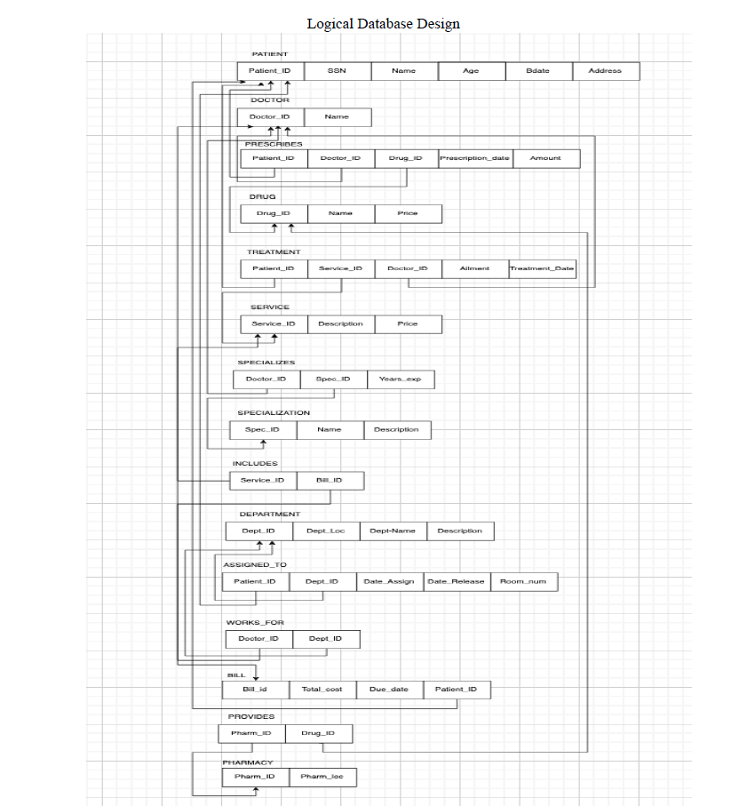

# Hospital-Database-SQL

## Overview
I took a Database System Design and Management course and created a database project with a team.
This project involves designing and implementing a hospital database. With Oracle, I used SQL for queries scripts, Data Definition Language (DDL) for creating tables, and Data Manipulation Language (DML) for inserting, updating, and querying data. The database efficiently organizes and manages hospital information, ensuring seamless operations and easy retrieval of patient, staff, and medical data for streamlined healthcare management.

## Contributors
- [dkhan21](https://github.com/dkhan21)
- [jackr276](https://github.com/jackr276)
- [Danielhr19](https://github.com/Danielhr19)

## SQL Source Code
- Check the [DDL File for Tables](ProjectDDLStatements.sql)
- Check the [DML File for Table's Values](ProjectInsertionStatements.sql)

## Entity Relationship Diagram

## Logical Database Design

## Important requirements during the creation of the database
- Primary Key
- Foreign Key
- Indexes
- Unique Constraint
- Check Constraint
- Not Null Constraint
- Normalization
- Data Types
- Triggers
- Stored Procedures
- Views
- Documentation
- Security Measures
